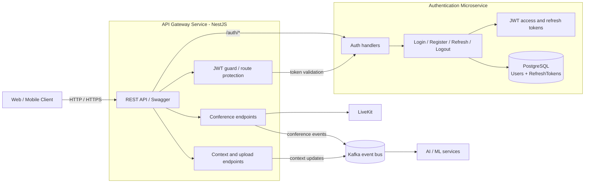

# Backend


We use modern `yarn`. See [log](./log.md#Yarn)
`ESNext` modules (not `nodenext`).
[ESM setup](https://www.prisma.io/docs/prisma-orm/quickstart/postgresql#3-configure-esm-support)

### Test /send endpoint:

Test /send endpoint:

change `input.png` to your image file path

```bash
curl -X POST http://localhost:3000/send \
  -F "file=@input.png" \
  -F "message=hello"
```

## Architecture

TODO: adjust the diagram to reflect the current state of the backend



Notes:

- Current MVP implementation keeps gateway and auth in one NestJS app under `apps/backend`.
- This schema shows the simplest next split: the API gateway exposes client-facing endpoints, and the auth service owns user lookup, password verification, JWT issuance, refresh rotation, and token revocation.
- Auth data maps to the current Prisma models: `User` and `RefreshToken`.

## Object Storage

Conference context files are stored through an S3-compatible backend. The MVP
uses AWS SDK v3, so the same code can work with AWS S3, RustFS, or another
S3-compatible service by changing environment variables.

Relevant endpoints:

```bash
curl -X POST http://localhost:3000/conference/my-room/upload \
  -F "file=@input.pdf"
```

The response includes `file.key`. Use it as the `file` query parameter to get a
temporary download URL:

```bash
curl "http://localhost:3000/conference/my-room/download?file=conferences/my-room/<object-key>"
```

Required environment variables are documented in `.env.example` under
`Object Storage`. `S3_ACCESS_KEY_ID` and `S3_SECRET_ACCESS_KEY` are shared by
the backend S3 client and the local RustFS service in compose. For local Docker
infra, the compose stack includes RustFS on ports `9000` (S3 API) and `9001`
(console). For a backend process on the host, use
`S3_ENDPOINT=http://localhost:9000`. For the backend container, `.env.production`
overrides it with `S3_ENDPOINT=http://rustfs:9000`.

## Realtime AI Streams

The MVP realtime context is kept in Redis by MLin. It listens to backend chat
events, LiveKit chat events, whiteboard snapshots, and voice transcripts
published by the LiveKit agent to `KAFKA_TRANSCRIPT_TOPIC`
(`conference.transcript.voice`). MLin republishes normalized transcript chunks
to `conference.transcript`, which the backend forwards to Socket.IO as
`transcript:new`. Backend Kafka clients use `KAFKA_BOOTSTRAP_SERVERS` when it is
set, falling back to `BACKEND_KAFKA_HOST:KAFKA_PORT`.

MLout reads the same Redis context for `conference.chat.ai.request` and
`conference.summary.request`, then publishes AI answers and summaries back to
Kafka for backend websocket delivery.

The backend persists the same MVP streams in PostgreSQL:

```bash
curl "http://localhost:3000/conference"
curl "http://localhost:3000/conference/my-room/chat"
curl "http://localhost:3000/conference/my-room/transcript"
curl "http://localhost:3000/conference/my-room/summary"
curl -X POST "http://localhost:3000/conference/my-room/summary/request"
curl -X POST "http://localhost:3000/conference/my-room/ticker" \
  -H "Content-Type: application/json" \
  -d '{"action":"start","intervalSeconds":60}'
curl -X POST "http://localhost:3000/conference/my-room/ticker" \
  -H "Content-Type: application/json" \
  -d '{"action":"stop"}'
```

`GET /conference` returns saved rooms for the archive UI for the authenticated
user only. A room is added to that personal archive when the user receives a
conference token. Guests do not receive the shared backend archive; the frontend
keeps a local list of guest room names in `localStorage`. Each room endpoint
returns JSON history. New frontend clients load this history over HTTP first,
then receive new `message:new`, `transcript:new`, and `summary:new` events over
Socket.IO. The frontend archive lives at `/history`, with read-only room history
at `/history/[conferenceName]`.

The creator can request a summary manually from the conference sidebar or start
a backend ticker. Before each `conference.summary.request` emit, the backend
checks LiveKit participants and skips the request when no non-agent participant
is currently in the room.
