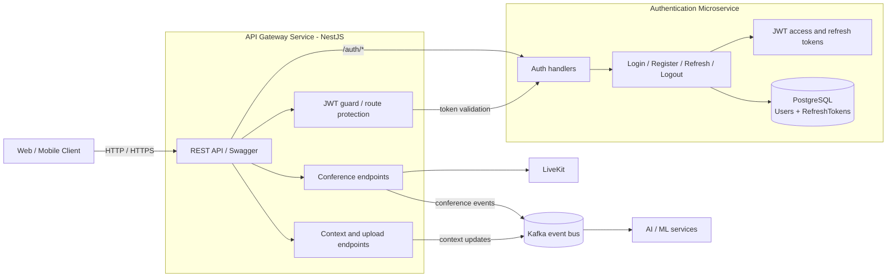

# Backend

We use modern `yarn`. See [log](./log.md#Yarn)
`ESNext` modules (not `nodenext`).
[ESM setup](https://www.prisma.io/docs/prisma-orm/quickstart/postgresql#3-configure-esm-support)

### Test /send endpoint:

Test /send endpoint:

change `input.png` to your image file path

```bash
curl -X POST http://localhost:3000/send \
  -F "file=@input.png" \
  -F "message=hello"
```

## Architecture

TODO: adjust the diagram to reflect the current state of the backend



Notes:

- Current MVP implementation keeps gateway and auth in one NestJS app under `apps/backend`.
- This schema shows the simplest next split: the API gateway exposes client-facing endpoints, and the auth service owns user lookup, password verification, JWT issuance, refresh rotation, and token revocation.
- Auth data maps to the current Prisma models: `User` and `RefreshToken`.
